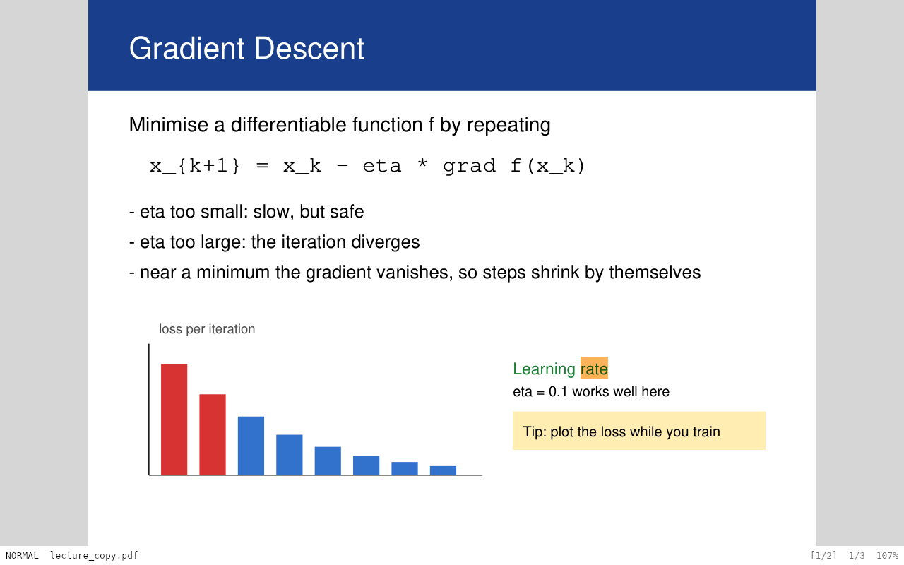
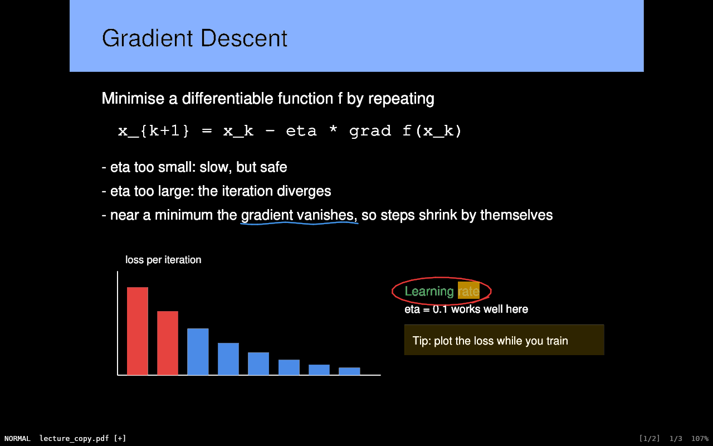

<p align="center">
  
</p>

# mizu 水

A small PDF viewer I wrote for studying. It does four things and tries to do them well:

- **Scrolls and zooms without stutter**, at any zoom level, and the text stays sharp.
- **Turns the page itself dark** (not just the window around it), with pure black and white by default.
- **Is driven from the keyboard** with Vim keys: `j`/`k`, `gg`/`G`, `/` search, marks, `:` commands.
- **Lets you scribble on the PDF** with a pen, an eraser and undo/redo, and saves the ink *into* the PDF.

No toolbar, no menus, no sidebar. A page and one line of status at the bottom, similar in spirit to
zathura and sioyek.

It runs on Linux (the machine I actually use it on: NixOS with Niri and Hyprland), Windows and macOS.

<p align="center">
  
  
</p>

## Why another PDF viewer

I read a lot of lecture slides and scripts, often late, and I annotate them by hand. The viewers I
tried were each missing something: dark mode that only dims the window, or Vim keys but no drawing,
or drawing that saves into a sidecar file I would eventually lose. So I wrote the one I wanted.
It is also a good excuse to learn how far you can push a GPU-composited document viewer.

## Install

### The install script (Linux and macOS)

```sh
git clone https://github.com/notflask/mizu && cd mizu
./scripts/install.sh
```

It builds mizu from the checkout and installs it for your user:

- **NixOS / Nix**: into your Nix profile (`nix profile install`), with the wrapper that finds the
  Wayland, Vulkan and xkb libraries, the desktop entry and the icons.
- **Other Linux distributions**: `~/.local/bin/mizu`, the desktop entry and the icons under
  `~/.local/share`. Missing build dependencies are listed with the install command for your
  distribution (apt, dnf, pacman, zypper).
- **macOS**: `~/Applications/mizu.app` (registered with Launch Services, so "Open With" knows it)
  and a `mizu` command in `~/.local/bin`.

Running it again upgrades in place. Useful options: `--system` (all users: `/usr/local`,
`/Applications`), `--prefix DIR`, `--universal` (macOS, arm64 + x86_64), `--default-pdf` (make
mizu the default PDF/EPUB app; never done without asking), `--dry-run`, and `--uninstall`, which
removes exactly the files it installed.

### Nix / NixOS, declaratively

```sh
nix run github:notflask/mizu -- some.pdf
```

or add it to your system:

```nix
# flake.nix inputs:   mizu.url = "github:notflask/mizu";
nixpkgs.overlays = [ mizu.overlays.default ];
environment.systemPackages = [ pkgs.mizu ];
```

The flake wraps the binary so that the Wayland, Vulkan and xkb libraries are found at run time.
`nix develop` gives you a shell with everything needed to build it.

### By hand

You need a recent stable Rust and `clang` (MuPDF is compiled from the sources that ship with the
`mupdf` crate, and its bindings are generated with bindgen).

```sh
cargo build --release
./target/release/mizu some.pdf
```

On Linux the usual window-system libraries (Wayland and/or X11, xkbcommon) and a Vulkan or OpenGL
driver have to be present at run time.

### Prebuilt binaries

Tagged releases carry a Linux tarball, an AppImage, a Windows zip and a macOS app bundle.
(Windows and macOS builds are produced by CI; I have mostly tested on Linux.)

## Using it

```
mizu [--page N] [--stats] [FILE]
```

Drop a PDF onto the window or type `:e path/to/file.pdf`. Mizu remembers where you were in every
file, and your marks, between runs.

### Keys

Counts work like in Vim: `5j`, `12G`.

| Key | Action |
|---|---|
| `j` `k` `h` `l` | scroll |
| `Ctrl-d` `Ctrl-u` | half a screen down / up |
| `Space` `Shift-Space`, `Ctrl-f` `Ctrl-b` | a screen down / up |
| `J` `K` | next / previous page |
| `gg` `G`, `42G` | first / last page, or go to page 42 |
| `+` `-` | zoom in / out |
| `=` or `zw`, `zf`, `z0` | fit width, fit page, 100 % |
| `/` `?`, `n` `N` | search forward / backward, next / previous hit |
| `m{a-z}`, `'{a-z}` | set a mark, jump to it |
| `Ctrl-o` `Ctrl-i` | back / forward in the jump list |
| `o` | table of contents (type to filter) |
| `D` | dark mode on / off |
| `i` | drawing mode, `Esc` leaves it |
| `u` `Ctrl-r` | undo / redo |
| `r` | reload the file |
| `:` | command line |
| `ZZ` `ZQ` | save and quit / quit without saving |

In drawing mode:

| Key / mouse | Action |
|---|---|
| left drag | draw (or erase, when the eraser is active) |
| right drag | erase while held |
| middle drag | pan |
| `1`–`9` | pick a colour from the palette |
| `[` `]` | thinner / thicker |
| `e` | switch between pen and eraser |

The mouse wheel scrolls, `Ctrl` + wheel zooms towards the cursor, and a touchpad pinch zooms where
the platform reports it. A pen with pressure draws variable-width lines (see *Status* below).

### Commands

| Command | |
|---|---|
| `:w` | write the PDF, ink included. `:w other.pdf` writes a copy |
| `:q`, `:q!` | quit (refuses if there is unsaved ink), quit anyway |
| `:wq`, `:x` | write and quit (`:x` only writes when something changed) |
| `:e file.pdf`, `:e!` | open a file, reload and drop unsaved ink |
| `:42` | go to page 42 |
| `:dark`, `:light` | switch the page colours |
| `:color #rrggbb`, `:width 2` | pen colour and width (points) |

Saving is explicit, like in Vim: nothing is written until you say `:w`.

### Configuration

`~/.config/mizu/config.toml` (macOS: `~/Library/Application Support/io.github.notflask.Mizu/`,
Windows: `%APPDATA%\notflask\Mizu\config\`). Everything is optional.

```toml
dark_by_default = false
statusbar = true
scroll_step = 60          # logical pixels per j / k
zoom_step = 1.2
tile_cache_mb = 256

[dark]
background = "#000000"
foreground = "#ffffff"
# separator = "#1a1a1a"   # thin line between pages, off by default

[pen]
width = 1.5
palette = ["#1a1a1a", "#e03131", "#1971c2", "#2f9e44", "#f08c00", "#9c36b5"]

[keys.normal]
"<C-n>" = "toggle_dark"   # add or override a binding
"D" = "none"              # remove a default

[keys.draw]
"x" = "toggle_eraser"
```

Action names are the ones in `src/input/actions.rs`: `scroll_down`, `half_page_down`, `goto_first`,
`zoom_in`, `fit_width`, `search_forward`, `set_mark`, `outline`, `toggle_dark`, `enter_draw`,
`undo`, `toggle_eraser`, `select_color_1` … `select_color_9`, and so on.

## How it works

A few decisions that are worth explaining, because they are where the time went.

**Tiles instead of one big bitmap.** Pages are rendered by MuPDF in 512×512 tiles at exactly the
current screen scale, on a small pool of worker threads (MuPDF documents are not `Send`, so every
worker opens its own copy). While you zoom, the tiles you already have are stretched; 120 ms after
you stop, the sharp ones are requested. A tiny preview of each page sits underneath everything, so
jumping with `G` never shows a blank screen. The UI thread never waits for a render.

**Few draw calls.** All tiles live in a handful of `texture_2d_array`s with recycled slots, and every
visible tile is one instance of one quad, so a whole frame is a few instanced draw calls. Uploads are
capped per frame so a burst of finished tiles cannot cause a hitch. Nothing is allocated while
scrolling; buffers are reused and tile pixel buffers travel back to the workers through a channel.

**Dark mode is a shader.** Toggling it changes one uniform; nothing is re-rendered. Neutral tones are
mixed in linear light, which is what makes anti-aliased black-on-white text come out as correct
light-on-dark text instead of thin and ragged. Coloured pixels (and images) keep their hue and chroma
and get their lightness inverted in Oklab, with chroma reduced where a colour would leave the sRGB
gamut. The same function exists in Rust (`src/render/recolor.rs`) and is unit tested; the shader
mirrors it.

**Ink is a signed distance field.** Each segment of a stroke is one instance, drawn as a tapered
capsule whose coverage comes from its signed distance. That gives round caps and joins, per-point pen
pressure, and clean edges at any zoom without any tessellation, and it recolours in dark mode like
everything else.

**Ink lives in the PDF.** Strokes are written as ordinary `/Ink` annotations (`/NM` = `mizu-<uuid>`),
so Okular, Firefox or Acrobat show them too, and mizu finds them again for editing. Pressure strokes
also carry their per-point pressure and a hand-written appearance stream so the shape survives in
other viewers. Saving goes to a temp file next to the original and is renamed over it, so a crash
cannot leave a half-written PDF. MuPDF never draws mizu's own strokes (the render workers strip them
from their in-memory copy), which is how they stay editable.

**Idle means idle.** The event loop sleeps until something happens. When nothing changes, mizu draws
zero frames and uses no CPU.

## Status

Works and is tested: viewing, zoom, scrolling, dark mode, search (with smartcase), outline, links,
marks and jump list, drawing, erasing, undo/redo, saving and reloading ink (including rotated pages),
auto-reload when the file changes on disk, password-protected PDFs, and session restore.

Things to know:

- Pen **pressure** and the **eraser end** work on Wayland (`tablet-v2`, together with touchpad pinch
  through `pointer-gestures`). On Windows, pens arrive through winit's touch events with force.
  Compositors without these protocols fall back to mouse behaviour and `Ctrl` + scroll.
- There is no text selection or copying. That is deliberate for now: it is a reader with a pen.
- I develop and test on Linux. The Windows and macOS builds compile in CI but have seen much less
  real use.

## Troubleshooting

If the window opens but stays black (or blank), the quickest way to find out why is
`--diag`: mizu then reads a few frames back from the GPU and logs how much of them is lit.

```sh
RUST_LOG=mizu=info,wgpu=warn mizu --diag some.pdf
```

"non-black 0 %" means the GPU really drew nothing; a lit frame that you cannot see means the
problem is between the graphics driver and the compositor. These switches help to narrow it
down (all are environment variables):

| Variable | Effect |
| --- | --- |
| `WGPU_BACKEND=vulkan` / `gl` | pick the graphics API |
| `WGPU_POWER_PREF=low` / `high` | pick the integrated / discrete GPU (default on Linux: high, so it matches a compositor running on the discrete GPU) |
| `MIZU_PRESENT_MODE=fifo` / `mailbox` / `immediate` | swap-chain present mode |
| `MIZU_SURFACE_FORMAT=bgra` / `rgba` | channel order of the swap chain |
| `MIZU_NO_PLATFORM_INPUT=1` | do not start the Wayland pen/pinch backend |

On Nix, `nix run github:notflask/mizu#diagnose -- some.pdf` runs mizu in several of these
configurations one after the other, asks which of them showed the page, and prints a report.

## Development

```sh
nix develop            # or install Rust + clang yourself
cargo test             # unit tests + integration tests against real MuPDF
cargo build --profile fast   # optimised build without LTO, quick to iterate on
```

The tests include round trips through real PDFs (saving and loading ink on rotated pages, search,
links, outline, tile rendering) and a CPU reference for the dark-mode colour maths.

There is a small scripting hook for end-to-end checks without a human: with
`MIZU_TEST_SCRIPT=script.txt` the viewer reads commands such as `key jjD`, `move 300 200`,
`down left`, `capture out.ppm`, `settle`, and takes real screenshots of its own window.
Under a headless compositor with a software Vulkan driver this is how the screenshots in
`docs/screenshots` were made.

`docs/PLAN.md` is the design document the project started from.

## License

AGPL-3.0-or-later, because it links MuPDF (© Artifex Software, AGPL). Fonts: DejaVu Sans Mono
(Bitstream Vera licence, see `assets/fonts/DejaVu-LICENSE.txt`).
